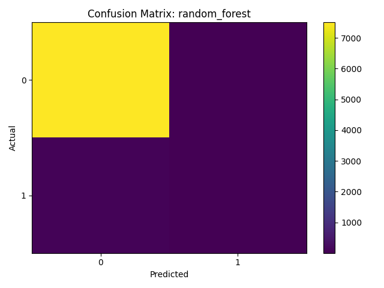
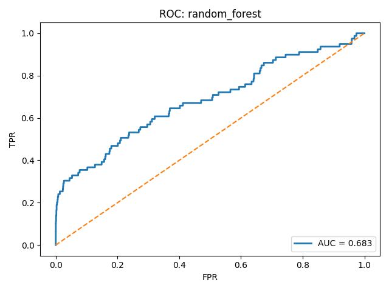
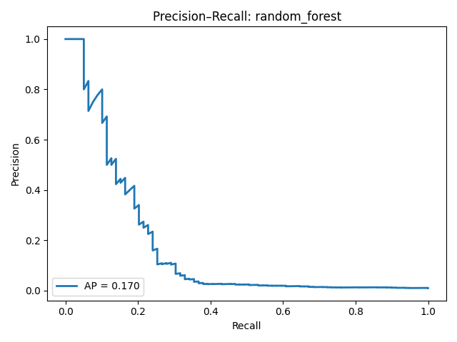
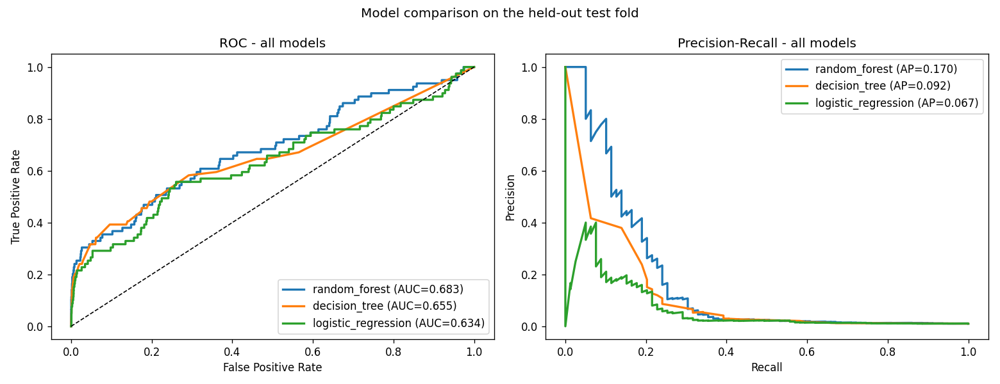
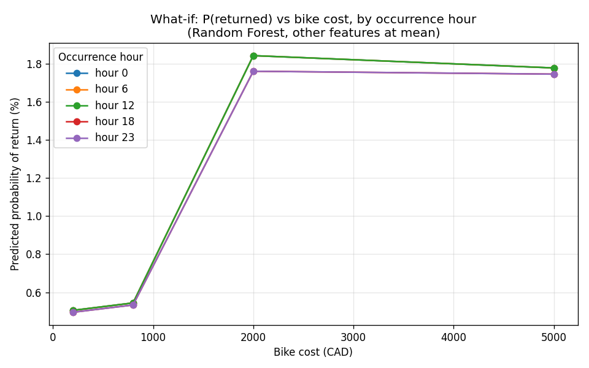
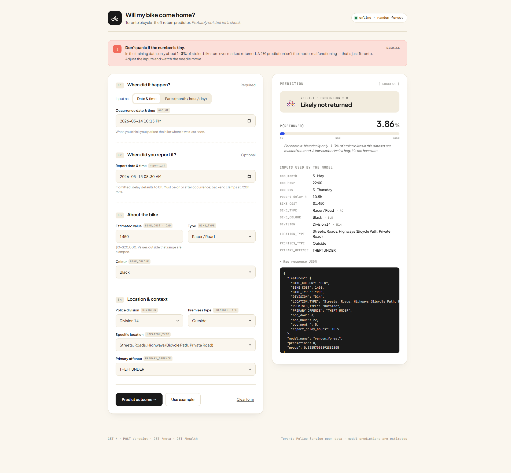

# 🚲 Homebound

> *Will my bike come home?* — a Toronto bicycle-theft return predictor.

A supervised machine-learning pipeline that estimates the **probability that a stolen bicycle will be returned or recovered** to its owner, trained on Toronto Police Service bicycle-theft records. The project covers the full lifecycle: data preprocessing and feature engineering, training and calibrating three classifiers, evaluation with confusion matrices and ROC/PR curves, a sensitivity ("what-if") analysis, and a Flask REST API with an embedded web UI for live single-incident predictions.

---

## 1. Problem Statement & Dataset

When a bicycle is reported stolen, only a small fraction is ever returned. This project frames recovery as a **binary classification** problem: given the circumstances of a theft (when, where, what kind of bike, how quickly it was reported), how likely is the bike to come back?

- **Source:** Toronto Police Service open bicycle-theft records — `data/bike_thefts.csv`
- **Size:** ~37,928 incidents, 36 raw columns
- **Target:** Derived from the `STATUS` column — `1` if the bike was `RECOVERED` / `RETURNED`, otherwise `0`
- **Severe class imbalance:** roughly **99%** of incidents are *not* returned. This dominates every metric and is the single most important caveat for interpreting results (see [Conclusions](#10-conclusions--limitations)).

Raw columns include offence, occurrence/report dates and times, police division, location/premises type, bike make/model/type/colour/cost, status, and geographic coordinates.

---

## 2. Repository Structure

```
bicycle-theft-prediction-main/
├── README.md                     # This document
├── requirements.txt              # Python dependencies
├── data/
│   └── bike_thefts.csv           # Raw dataset (~37,928 rows, 36 cols)
├── src/
│   ├── preprocess.py             # Loading, feature engineering, encoding, split
│   ├── train_models.py           # Train + calibrate 3 models, pick best
│   ├── evaluate_models.py        # Metrics, CM/ROC/PR plots, what-if sweep
│   ├── app.py                    # Flask REST API (/, /health, /meta, /predict)
│   ├── client.py                 # CLI client for testing the API
│   ├── make_extra_plots.py       # Model-comparison + what-if summary plots
│   ├── templates/index.html      # Prediction web UI (Jinja template)
│   └── static/
│       ├── app.js                # UI logic: /health + /meta, validation, render
│       └── styles.css            # High-fidelity theme (Claude Design handoff)
├── models/                       # Serialized artifacts (created by training)
│   ├── random_forest.joblib      # Best model
│   ├── decision_tree.joblib
│   ├── logistic_regression.joblib
│   ├── encoder.joblib            # Fitted OneHotEncoder
│   ├── scaler.joblib             # Fitted StandardScaler
│   ├── cat_keepers.joblib        # Top-k category keep-lists
│   ├── feature_names.json        # Canonical feature order for inference
│   └── best_model.txt            # Name of the selected best model
└── reports/                      # Generated metrics & charts
    ├── summary_metrics.csv       # Training-time metrics
    ├── summary_metrics_eval.csv  # Evaluation metrics (authoritative)
    ├── what_if_random_forest.csv # Sensitivity sweep results
    ├── cm_*.png                  # Confusion matrices (3 models)
    ├── roc_*.png                 # ROC curves (3 models)
    ├── pr_*.png                  # Precision-recall curves (3 models)
    ├── model_comparison.png      # Overlaid ROC + PR for all three models
    ├── what_if_plot.png          # What-if sweep line chart
    └── web_ui.png                # Captured screenshot of the running web UI
```

---

## 3. Pipeline Overview

| Stage | File | Responsibility |
|-------|------|----------------|
| Preprocess | `src/preprocess.py` | Parse dates, engineer features, build top-k category keep-lists, one-hot encode, standard-scale, stratified 80/20 split, serialize artifacts |
| Train | `src/train_models.py` | Train Logistic Regression, Decision Tree, Random Forest with class balancing + probability calibration; select best by AUC → AP → accuracy |
| Evaluate | `src/evaluate_models.py` | Recompute metrics on the held-out fold, generate confusion matrices and ROC/PR curves, run the what-if sensitivity sweep |
| Serve | `src/app.py` | Flask API (`/`, `/health`, `/meta`, `/predict`) serving a templated web UI (`templates/` + `static/`) for one-off predictions |
| Test | `src/client.py` | Command-line client that posts an example payload to the API |

---

## 4. Feature Engineering

`src/preprocess.py` transforms the raw records into a model-ready matrix:

**Temporal / cyclical**
- `occ_month`, `occ_hour`, `occ_dow` extracted from the occurrence timestamp
- **Cyclical encodings** — `occ_month_sin/cos`, `occ_hour_sin/cos` so the model treats time as circular (hour 23 is close to hour 0; December is close to January)
- `is_weekend` flag (day-of-week ≥ 5)
- `report_delay_hours` — hours between occurrence and report, clipped to `[0, 720]`

**Financial**
- `bike_cost_log` — `log1p` of bike cost, clipped to `[0, 20000]` CAD to dampen outliers

**Categorical** (one-hot encoded after rare-category folding)
- `BIKE_TYPE`, `BIKE_COLOUR`, `DIVISION`, `LOCATION_TYPE`, `PREMISES_TYPE`, `PRIMARY_OFFENCE`
- A **top-k keep-list (k = 12)** is learned *from the training fold only*. Categories outside the top-k — and missing values — collapse to `"Other"`, preventing one-hot explosion and train/test leakage.

**Scaling & split**
- Numeric features: median imputation → `StandardScaler` (fit on train only)
- 80/20 **stratified** train/test split (`random_state=42`)
- Encoder, scaler, keep-lists, and feature order are serialized to `models/` so inference reproduces training exactly.

---

## 5. Modeling Approach

`src/train_models.py` trains three classifiers, all with class-imbalance handling and post-hoc probability calibration:

| Model | Key hyperparameters | Imbalance handling |
|-------|---------------------|--------------------|
| Logistic Regression | `C=1.0`, `solver=liblinear`, `max_iter=1000` | `class_weight="balanced"` |
| Decision Tree | `max_depth=8`, `min_samples_leaf=50` | `class_weight="balanced"` |
| Random Forest | `n_estimators=300`, `max_depth=12`, `min_samples_leaf=10`, `n_jobs=-1` | `class_weight="balanced_subsample"` |

- **Calibration:** a 20% slice of the training fold is held out, and each fitted model is wrapped in `CalibratedClassifierCV` (sigmoid / Platt scaling) so predicted probabilities are more trustworthy for thresholding.
- **Model selection:** models are ranked by **AUC → Average Precision → Accuracy**; the winner is written to `models/best_model.txt` (currently **Random Forest**).

---

## 6. Results

Metrics on the held-out test fold, **observed by re-running the pipeline on this machine** (scikit-learn 1.8.0); written to `reports/summary_metrics_eval.csv`:

| Model | Accuracy | ROC AUC | Avg. Precision |
|-------|----------|---------|----------------|
| **Random Forest** ✅ | **0.9900** | **0.6833** | **0.1703** |
| Decision Tree | 0.9896 | 0.6552 | 0.0920 |
| Logistic Regression | 0.9896 | 0.6342 | 0.0669 |

> ⚠️ The ~99% accuracy is **not** a sign of a strong model — a "predict everything as not-returned" baseline would score similarly because of the class imbalance. **AUC** and **Average Precision** are the honest discrimination metrics. Random Forest is the best of the three on both, but AP ≈ 0.17 confirms recovering the rare positive class is genuinely hard.

> ℹ️ Numbers differ marginally from a prior run (RF AUC 0.6817 → 0.6833, AP 0.1619 → 0.1703) purely due to a newer scikit-learn version's RNG/algorithm changes — the ranking and conclusions are unchanged, illustrating that the pipeline is reproducible but not bit-identical across library versions.

### Per-class reality check (classification report, test fold)

Accuracy hides what actually matters. The real behaviour on the **positive ("returned") class** — only 79 of 7,586 test incidents — observed from `python src/evaluate_models.py`:

| Model | Precision (returned) | Recall (returned) | F1 (returned) |
|-------|----------------------|-------------------|---------------|
| Random Forest | **0.71** | 0.06 | 0.12 |
| Decision Tree | 0.00 | 0.00 | 0.00 |
| Logistic Regression | 0.00 | 0.00 | 0.00 |

This is the headline finding: **Decision Tree and Logistic Regression predict essentially zero returns** at the 0.5 threshold (sklearn even emits an `UndefinedMetricWarning` because they make no positive predictions). Random Forest is the only model with any positive-class signal — when it *does* flag a bike as likely-returned it is right ~71% of the time, but it only catches ~6% of actual returns. A useful recovery model would need threshold tuning and/or resampling (see [Conclusions](#10-conclusions--limitations)).

### Best model — Random Forest

| Confusion Matrix | ROC Curve | Precision–Recall |
|---|---|---|
|  |  |  |

Equivalent per-model charts are available in `reports/`:
`cm_decision_tree.png`, `roc_decision_tree.png`, `pr_decision_tree.png`,
`cm_logistic_regression.png`, `roc_logistic_regression.png`, `pr_logistic_regression.png`.

### All three models, side by side

Generated by `python src/make_extra_plots.py` (overlaid ROC and Precision–Recall on the same held-out fold):



The PR panel makes the imbalance problem vivid: every model's precision collapses almost immediately as recall increases. Random Forest (AP 0.170) dominates the other two across the whole curve, but no model sustains useful precision past ~20% recall.

---

## 7. What-If / Sensitivity Analysis

`src/evaluate_models.py` sweeps the best model over a grid of **occurrence hour** (`0, 6, 12, 18, 23`) × **bike cost** (`$200, $800, $2,000, $5,000`), holding other features at their mean. Results are saved to `reports/what_if_random_forest.csv`.

Findings (from the regenerated `reports/what_if_random_forest.csv`):

- Predicted return probability stays **low across the board — roughly 0.50% to 1.84%**.
- **Bike cost is the dominant lever:** probability is flat (~0.5%) for cheap bikes (\$200–\$800) then jumps sharply to ~1.8% once cost reaches \$2,000+ (more valuable bikes are more likely to be flagged/recovered).
- **Time of day has a mild effect:** evening/night incidents (hours 18 and 23) sit slightly below daytime (hours 0/6/12), which overlap exactly.

This confirms the model is conservative and reflects the genuinely low base rate of recovery rather than producing arbitrarily confident predictions.



---

## 8. Setup & Usage

### Install

```bash
pip install -r requirements.txt
```

### Train models

```bash
python src/train_models.py
```

Produces `models/*.joblib`, `models/best_model.txt`, and `reports/summary_metrics.csv`.

> ⚠️ `src/train_models.py` and `src/evaluate_models.py` hardcode an absolute
> `DATA_PATH` to a machine-specific folder. Run them from the project root and
> point the path at this repo's copy of the data, e.g.:
>
> ```bash
> python -c "import sys; sys.path.insert(0,'src'); import train_models as t; t.DATA_PATH='data/bike_thefts.csv'; t.main()"
> ```

### Evaluate & generate charts

```bash
python src/evaluate_models.py    # (apply the same DATA_PATH override as above)
```

Produces `reports/summary_metrics_eval.csv`, the confusion-matrix / ROC / PR PNGs, and `reports/what_if_random_forest.csv`.

### Generate the summary plots

```bash
python src/make_extra_plots.py    # (apply the same DATA_PATH override as above)
```

Produces `reports/model_comparison.png` (overlaid ROC + PR for all three models) and `reports/what_if_plot.png` (the what-if sweep line chart).

### Reproducing the Results — observed console output

The pipeline was executed end-to-end on this machine (Python 3.13, scikit-learn 1.8.0). Trimmed real output:

```text
$ python src/train_models.py
=== Summary ===
              model  accuracy      auc  avg_precision
      random_forest  0.989982 0.683279       0.170345
      decision_tree  0.989586 0.655204       0.092004
logistic_regression  0.989586 0.634162       0.066933

Best model: random_forest

$ python src/evaluate_models.py
=== random_forest ===
              precision    recall  f1-score   support
           0       0.99      1.00      0.99      7507
           1       0.71      0.06      0.12        79
    accuracy                           0.99      7586

=== decision_tree ===   (and logistic_regression)
           1       0.00      0.00      0.00        79     # predicts no returns

Saved variability sweep to reports/what_if_random_forest.csv
```

### Run the prediction service

```bash
python src/app.py
```

Then open **http://127.0.0.1:5001/** in a browser. The UI implements a
high-fidelity design (Claude Design handoff): a warm "cobalt & coral" theme,
Plus Jakarta Sans + JetBrains Mono, a two-column form/result split with a sticky
result card. It loads category options from `GET /meta` so the six categorical
fields are **dropdowns of the model's real known values** (no more silent
fold-to-`Other`), with the raw code shown beside each human label; a segmented
occurrence-time toggle (date-picker vs. month/hour/day parts), a live `/health`
status pill, a dismissible "~1–3% is normal" expectation banner, client-side
validation with inline errors, and four result states (idle / loading / success
/ error) with a probability bar meter, "Other"-fold warning, echoed features,
and a collapsible raw-JSON view. Live capture after *Use example* → *Predict*
(raw JSON expanded):



> Markup is in `src/templates/index.html`; styles in `src/static/styles.css`;
> behavior (real `/health` + `/meta` + `/predict` wiring, validation, the four
> states) in `src/static/app.js`. The mock APIs from the design prototype are
> **not** shipped — the page calls the real Flask endpoints.

### Test from the command line

```bash
python src/client.py --use-occ-dt --with-report-delay 12
```

> ⚠️ As written, `client.py` does **not run at all** — it fails with a hard
> `SyntaxError` before doing anything (see [Known Issues](#11-known-issues)).
> Until it is fixed, exercise the API directly, e.g.:
>
> ```bash
> curl -X POST http://127.0.0.1:5001/predict -H "Content-Type: application/json" \
>   -d '{"occ_dt":"2024-06-15T18:30","report_dt":"2024-06-16T06:30","BIKE_COST":1200,"BIKE_TYPE":"RC","BIKE_COLOUR":"BLK","DIVISION":"D14","LOCATION_TYPE":"Streets, Roads, Highways (Bicycle Path, Private Road)","PREMISES_TYPE":"Outside","PRIMARY_OFFENCE":"THEFT UNDER"}'
> ```
> (Uses the model's real category codes — see `GET /meta` for the full list — so nothing folds to `"Other"`.)

---

## 9. API Reference

The Flask app (`src/app.py`) exposes:

| Method | Route | Purpose |
|--------|-------|---------|
| `GET` | `/` | Prediction web UI (rendered from `templates/index.html`) |
| `GET` | `/health` | JSON health check — selected model name and expected feature order |
| `GET` | `/meta` | Category options (real model values + human-readable labels) and numeric bounds; powers the form dropdowns |
| `POST` | `/predict` | Single-incident prediction |
| `OPTIONS` | `/predict` | CORS preflight |

**Real `GET /health` response** (captured from the running service):

```json
{
  "status": "ok",
  "model": "random_forest",
  "encoder_loaded": true,
  "scaler_loaded": true,
  "keepers_loaded": true,
  "numeric_order": ["occ_month","occ_hour","occ_dow","occ_month_sin","occ_month_cos","occ_hour_sin","occ_hour_cos","is_weekend","report_delay_hours","bike_cost_log"],
  "cat_order": ["BIKE_TYPE","BIKE_COLOUR","DIVISION","LOCATION_TYPE","PREMISES_TYPE","PRIMARY_OFFENCE"]
}
```

**Real `POST /predict` request** (keys are UPPERCASE for categoricals, `occ_dt`
is ISO; categorical values must be the model's real codes — the redesigned UI's
dropdowns guarantee this, and `GET /meta` lists them with friendly labels):

```json
{
  "occ_dt": "2024-06-15T18:30",
  "report_dt": "2024-06-16T06:30",
  "BIKE_COST": 1200,
  "BIKE_TYPE": "RC",
  "BIKE_COLOUR": "BLK",
  "DIVISION": "D14",
  "LOCATION_TYPE": "Streets, Roads, Highways (Bicycle Path, Private Road)",
  "PREMISES_TYPE": "Outside",
  "PRIMARY_OFFENCE": "THEFT UNDER"
}
```

**Real response** (captured from the running service — note the categoricals are
preserved, **not** folded to `"Other"`, because real codes were used):

```json
{
  "model_name": "random_forest",
  "prediction": 0,
  "proba": 0.01209973231197794,
  "features": {
    "BIKE_TYPE": "RC", "BIKE_COLOUR": "BLK", "DIVISION": "D14",
    "LOCATION_TYPE": "Streets, Roads, Highways (Bicycle Path, Private Road)",
    "PREMISES_TYPE": "Outside", "PRIMARY_OFFENCE": "THEFT UNDER",
    "occ_month": 6, "occ_hour": 18, "occ_dow": 5,
    "BIKE_COST": 1200.0, "report_delay_hours": 12.5
  }
}
```

`prediction: 0` with `proba ≈ 0.012` means *not likely returned* (~1.2% chance)
— consistent with the very low base recovery rate.

**Error response** — bad input returns HTTP `400` with an `{"error": ...}` body
(e.g. omitting all occurrence-time fields):

```json
{ "error": "Provide either occ_month/occ_hour/occ_dow or a single 'occ_dt'." }
```

The redesigned frontend branches on `res.ok` / the `error` key and shows a
distinct **error** state — fixing the prior bug where a 400 rendered as a red
"LIKELY NOT RETURNED" prediction.

---

## 10. Conclusions & Limitations

**What the project demonstrates**
- A complete, reproducible ML pipeline: leakage-safe preprocessing, calibrated models, honest evaluation, and a deployable inference service.
- Random Forest is the strongest of the three classifiers (AUC ≈ 0.68, AP ≈ 0.17) and the **only** model that produces any positive-class predictions at the default threshold — Decision Tree and Logistic Regression collapse to "never returned" (recall 0.00).
- The most informative signal for recovery is **bike value**, with a secondary, weaker time-of-day effect.

**Limitations**
- **Severe class imbalance (~99% not returned)** caps achievable precision/recall for the positive class. High accuracy is misleading; AUC/AP tell the real story.
- The dataset has substantial missing values (bike make/model/colour/cost frequently blank), limiting feature richness.
- The what-if sweep operates on a coarse, standardized feature grid (other features fixed at the mean), so it shows directional trends rather than exact real-world probabilities.

**Possible next steps**
- Add geospatial features from `LAT_WGS84`/`LONG_WGS84` and neighbourhood fields.
- Try resampling (SMOTE / undersampling) or cost-sensitive boosting; `imbalanced-learn` and `xgboost` are already in `requirements.txt` but unused.
- Tune the decision threshold against a business objective rather than the default 0.5.
- Add feature-importance / SHAP explanations to the API response.

---

## 11. Known Issues

**Compatibility fixes applied** (minimal, behaviour-preserving — required to run on a current Python/library stack):

- `src/preprocess.py`: removed the `infer_datetime_format=True` argument from `pd.to_datetime(...)` — that keyword was deprecated in pandas 2.0 and **removed** in later versions (this machine has pandas 3.0.2). Modern pandas infers the format automatically, so behaviour is unchanged.
- `src/train_models.py`: `CalibratedClassifierCV(estimator=model, cv="prefit")` was replaced with the `FrozenEstimator` wrapper (with a fallback to the old API). `cv="prefit"` was removed in scikit-learn 1.6+ (this machine has 1.8.0); `FrozenEstimator` is the supported replacement and preserves the "calibrate an already-fitted model" semantics.

**Frontend redesign (resolved in prior iterations, still in effect):**

The most recent UI iteration applied a high-fidelity Claude Design handoff
(theme/typography/layout) on top of the structural fixes below — all of which
remain in place:

- The web UI moved from a single inline HTML/JS string in `app.py` into
  `src/templates/index.html` + `src/static/{app.js,styles.css}`, served via
  `render_template`.
- **Silent category folding fixed:** the six categorical inputs are now
  dropdowns populated from the new `GET /meta` endpoint (real model categories
  with human-readable labels), so user input can no longer be silently coerced
  to `"Other"`.
- **Error-handling bug fixed:** a `400 {"error": ...}` previously rendered as a
  red "LIKELY NOT RETURNED" prediction; the new JS branches on `res.ok`/`error`
  and shows a dedicated error state.
- A `/meta` serialization edge case was fixed: `cat_keepers.joblib` contains a
  float `NaN` for `BIKE_COLOUR`, which `jsonify` emitted as invalid JSON;
  `build_meta()` now coerces it to `"nan"` (labelled "Unknown / not specified").

Verified bugs still present in the source (left as-is unless you want them fixed):

- **`src/client.py` is non-functional:** line 29 contains `args.with-report-delay` (hyphen). This is not a runtime error but a **hard `SyntaxError`** — the script fails to parse and cannot run at all. It should be `args.with_report_delay`.
- **Hardcoded dataset path:** `src/train_models.py` (line 22) and `src/evaluate_models.py` (line 20) hardcode `DATA_PATH` to a machine-specific absolute folder that does not exist in this repo; the commented-out `os.environ.get("DATA_PATH", "data/bike_thefts.csv")` line just above it shows the intended configurable default. Use the override shown in [§8](#8-setup--usage).
- **Unused dependencies / stale docs:** `requirements.txt` lists `xgboost`, `imbalanced-learn`, and `seaborn`, and earlier project notes referenced XGBoost, but only Logistic Regression, Decision Tree, and Random Forest are actually trained.

---

## 12. Tech Stack

`pandas` · `numpy` · `scikit-learn` · `Flask` · `joblib` · `matplotlib` · `requests`

(`xgboost`, `imbalanced-learn`, `seaborn` are declared but not currently used.)
